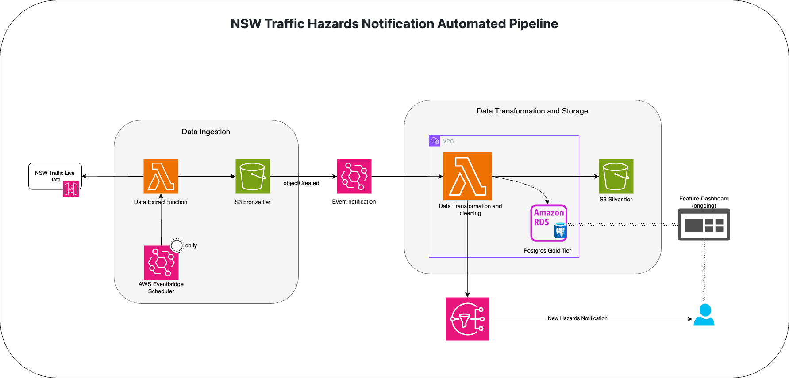

# NSW Traffic Hazards Notification (Automation)

## Project Overview
This project implements an automated pipeline for road hazards processing and notification by utilising various AWS Cloud Services. It ingests live traffic data from NSW traffic data hub, processes it, stores it and provide notifications for new hazards.

**Update Terraform Automation**

## System Architecture

## Pipeline Flow
**Data Ingestion:**
- NSW Traffic Live Data is ingested daily through an AWS Lambda function triggerd by EventBridge Scheduler.
- The raw data is kept in an S3 bronze tier bucket.
- An event notice is sent when an object is created in the S3 bucket.

**Data Transformation and Storage:**
- A Lambda function is activated for data transformation and cleaning.
- The processed data is stored in an S3 silver tier bucket.
- The ready-to-use data is saved in an Amazon RDS PostgreSQL database(Gold Tier).

**Notification System:**
- End-users receive notifications by email via Amazon SNS when new threats occur.

**Feature Dashboard:**
Under construction for data visualisation (not yet deployed).

## Future Enhancements Ideas
- Implement the feature dashboard for data visualization.
- Improve pipeline by utilising deployment automation tool, such as Terraform.
- Implement data analytics for trend analysis and predictive modeling.